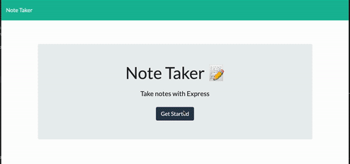

# hw11 Note Taker

[]()

## Table of Contents

- [ Description ](#des)
- [ User Story ](#us)
- [ Business Context ](#bc)
- [ Installation](#ins)
- [ Demonstration ](#demo)
- [ Deployed Link](#link)
- [ Tech Used](#tech)
- [ Questions](#q)

## Description <a name="des"></a>

This is an application that can be used to write, save, and delete notes. This application will use an express backend and save and retrieve note data from a JSON file.

## User Story <a name="us"></a>

```
AS A user, I want to be able to write and save notes

I WANT to be able to delete notes I've written before

SO THAT I can organize my thoughts and keep track of tasks I need to complete
```

## Business Context <a name="bc"></a>

```
For users that need to keep track of a lot of information, it's easy to forget or be unable to recall something important. Being able to take persistent notes allows users to have written information available when needed.
```

## Installation <a name="ins"></a>

> (1) Assuming you’ve already installed [Node.js](https://nodejs.org/en/) create a directory to hold your application, and make that your working directory.
> `$ mkdir notetaker $ cd notetaker`
>
> (2) Install all dependencies
>
> ```
> $ npm i
> ```
>
> (3) Start app
>
> ```
> $ npm start
> ```

## Demonstration <a name="demo"></a>



## Deployed Link <a name="link"></a>

The project is deployed to Heroku and available for view :
<https://uw11-note-taker.herokuapp.com>

## Tech Used <a name="tech"></a>

<p>
    
    
    
    
    
</p>

## Questions <a name="q"></a>

- create an issue : <https://github.com/lk9988/hw11_Note_Taker/issues>
